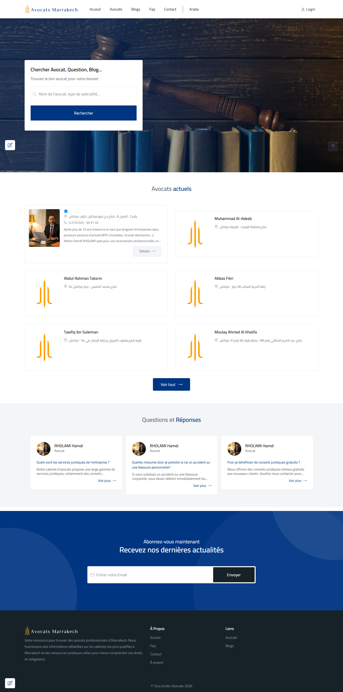
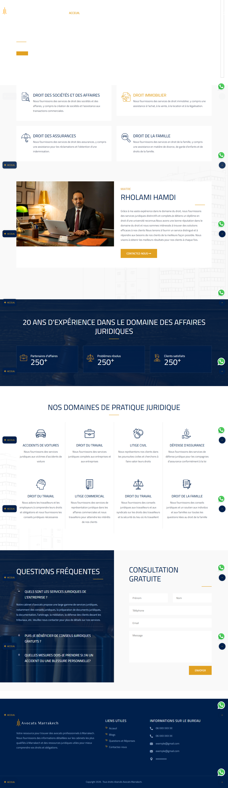
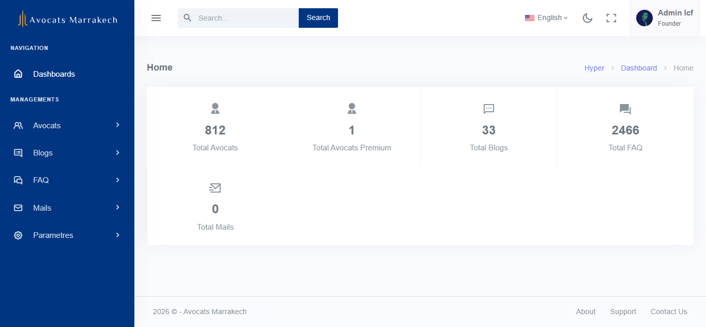
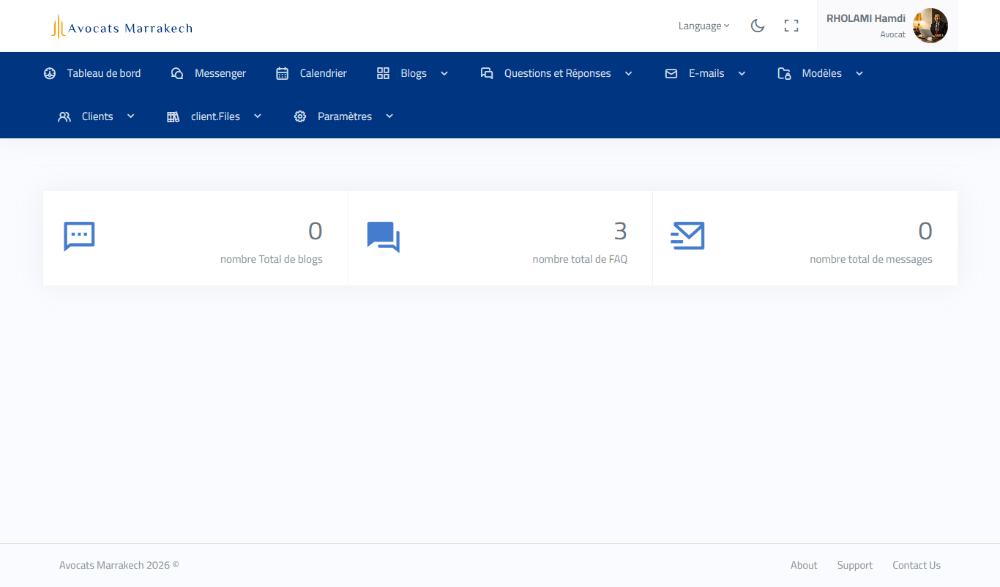
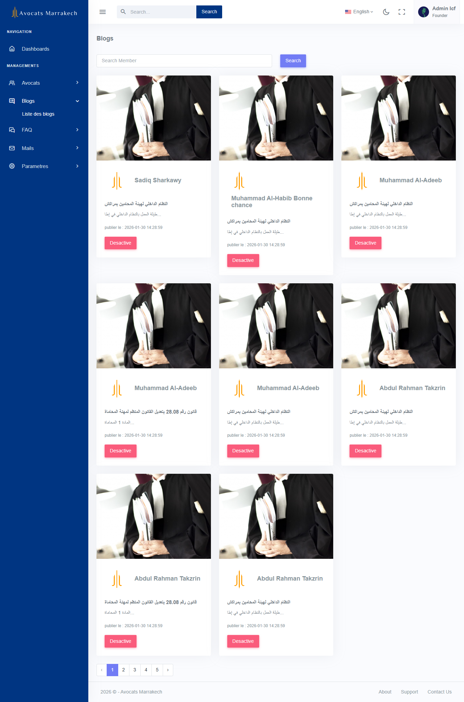
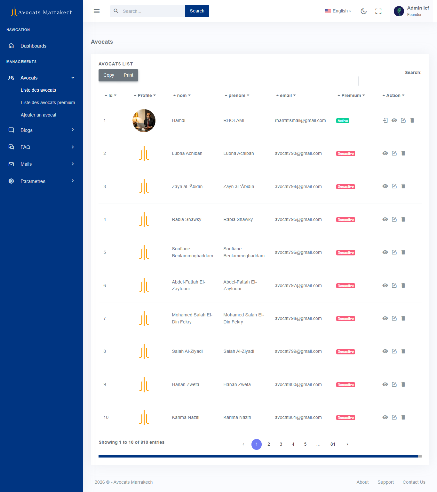
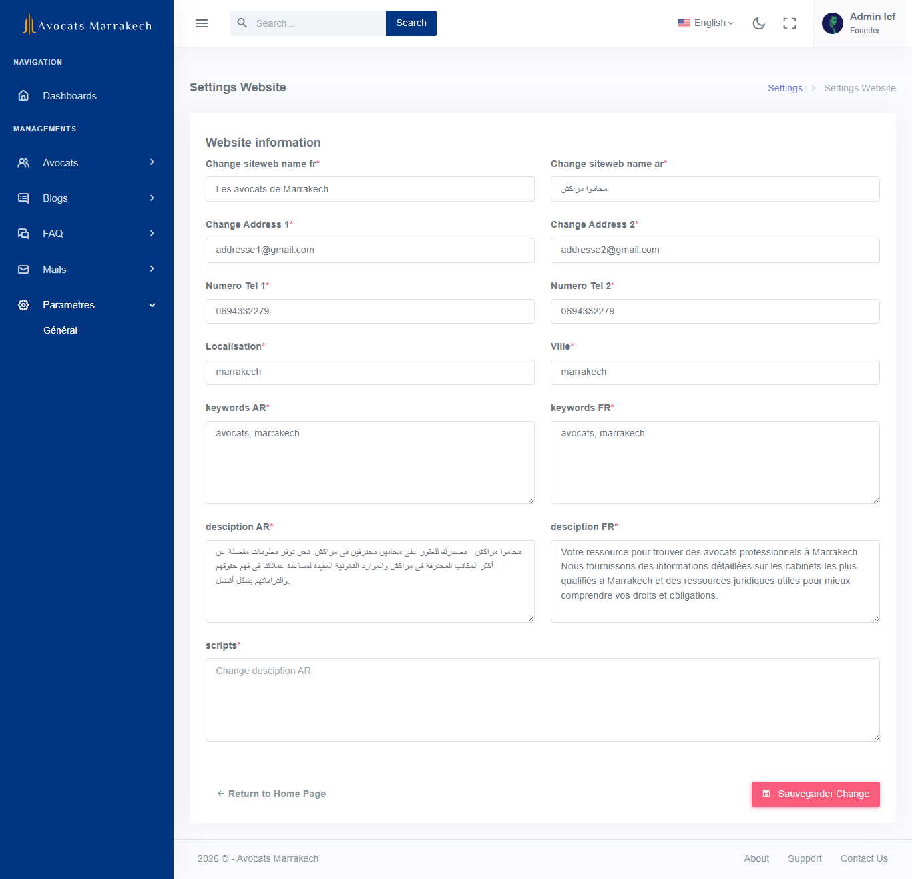

# ⚖️ Avocat Platform – Full-Stack Web Application

## 📌 Project Overview
Avocat Platform is a full-stack web application that connects clients with lawyers (avocats).
Clients can browse lawyer profiles, while each lawyer can register, log in, and manage a personalized landing page through a dashboard.

This project demonstrates full-stack development using Laravel, including authentication, dashboards, and role-based access.

---

## 🚀 Features

### 👤 Client Side
- Browse a list of available lawyers
- View detailed lawyer profiles
- Contact lawyers through the platform

### 👨‍⚖️ Lawyer Side
- User authentication (sign up / login)
- Personal landing page for each lawyer
- Manage profile information and services
- Dedicated dashboard for content management

### 🛠 Admin / System
- User and lawyer management
- Role-based access control
- Secure authentication system

---

## 🧰 Tech Stack
- **Backend:** Laravel (PHP)
- **Frontend:** Blade, HTML, CSS, JavaScript
- **Database:** MySQL
- **Authentication:** Laravel built-in Auth
- **Architecture:** MVC

---

## 🗂 Database Structure (Summary)
- Users (clients & lawyers)
- Lawyer profiles
- Roles and permissions
- Relationships between users and profiles

---

## 📷 Screenshots

### Homepage


### Details


### Dashboard


### Dashboard For Premium Lawyers


### List Blog


### List Lawyers


### Settings


---

## ⚙️ Installation & Setup

```bash
git clone https://github.com/your-username/avocat-laravel.git
cd avocat-laravel
composer install
cp .env.example .env
php artisan key:generate
php artisan migrate
php artisan serve
